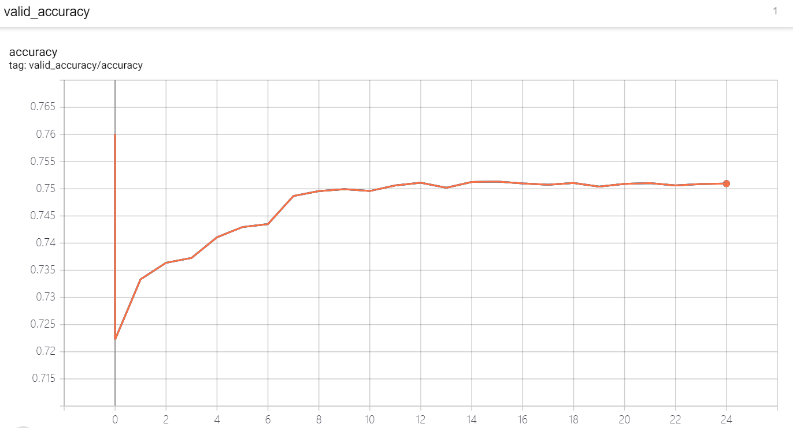

This is the implementation of CNN neural network pruning with [taylor filter pruning](https://openaccess.thecvf.com/content_CVPR_2019/papers/Molchanov_Importance_Estimation_for_Neural_Network_Pruning_CVPR_2019_paper.pdf). Experiments are done from pruning 1700 and 2200 filter out of 11000+. For the former one, accuracy is 75.61 and latter on 75.13 with the original 76.00. 

With reference from torhvision classification as well as nni  microsoft model compression. New features include customerize Taylor pruning (RELU pruning include
skip connections surpport, new iterative pruning schedules), DDP training with
Pytorch, writing convergency tensorboard events, debug and info logging output surport are added.

As we can see from below figure, with 25 epochs fine tune, the accuracy is 75.3 for 2200 neutrons pruned filter pruning with 2GPU and batchsize=128. For
the 1700 neutrons pruned filter pruning, the accuracy is 75.6 and speedup is around 1.2x for batchsize=64.

After speedup the new model structure can be found in speedup_model_architecture.log and speedup_model_architecture_2200.log.

Attention for speedup the modeling (modifying the model structure according to pruning done, pytorch 1.5 rather pytorch 1.7 should be used.)
